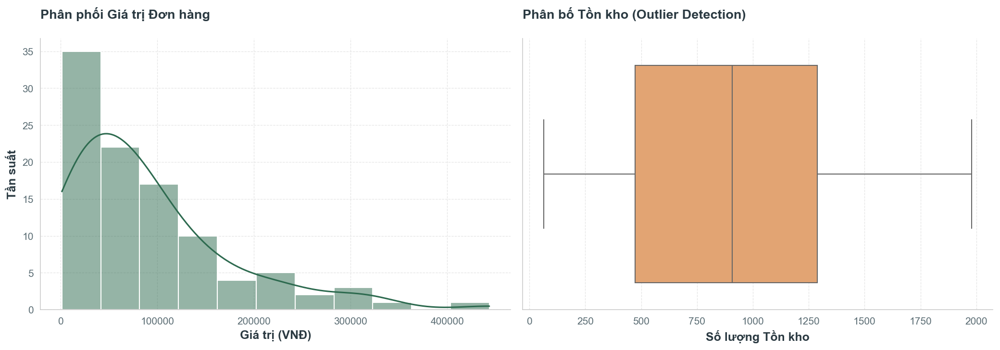
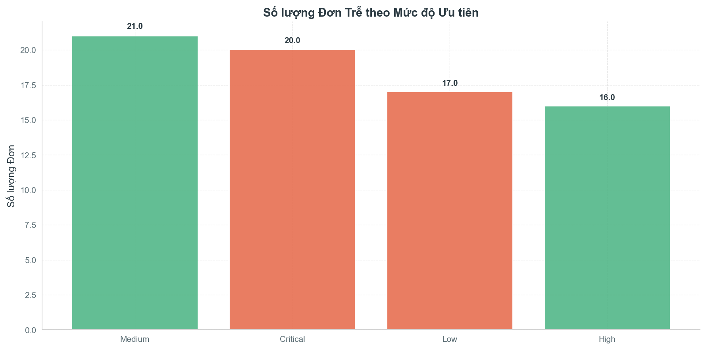
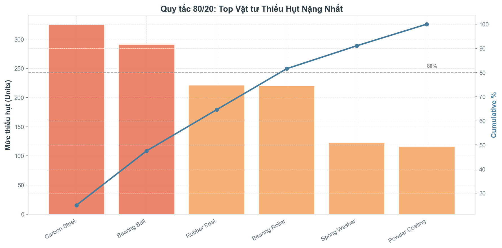
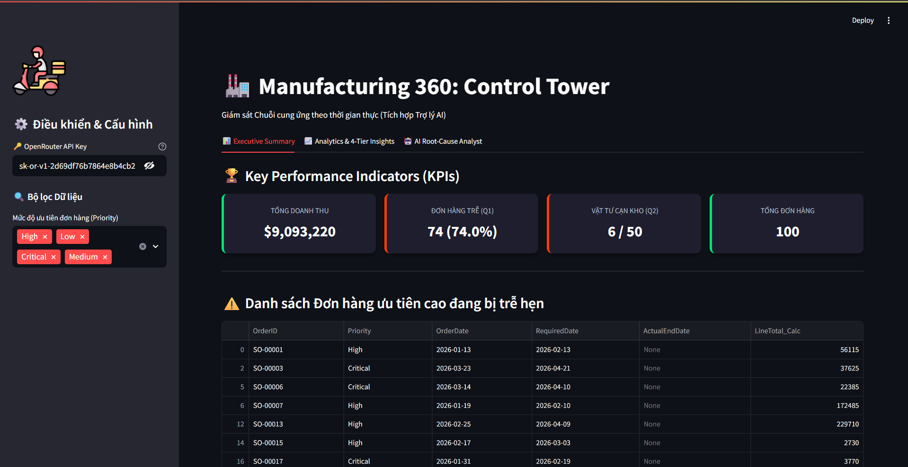
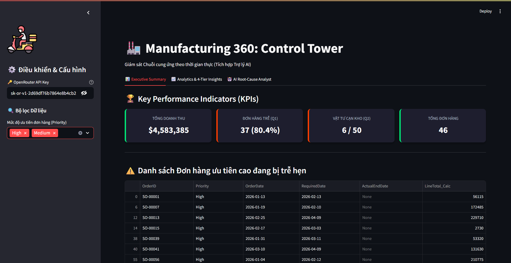
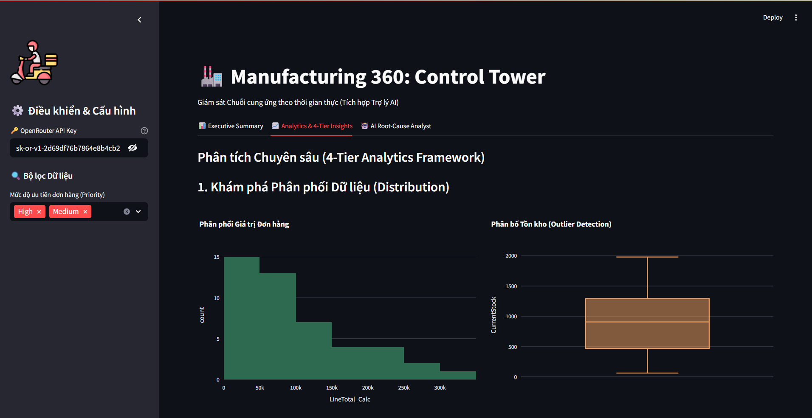
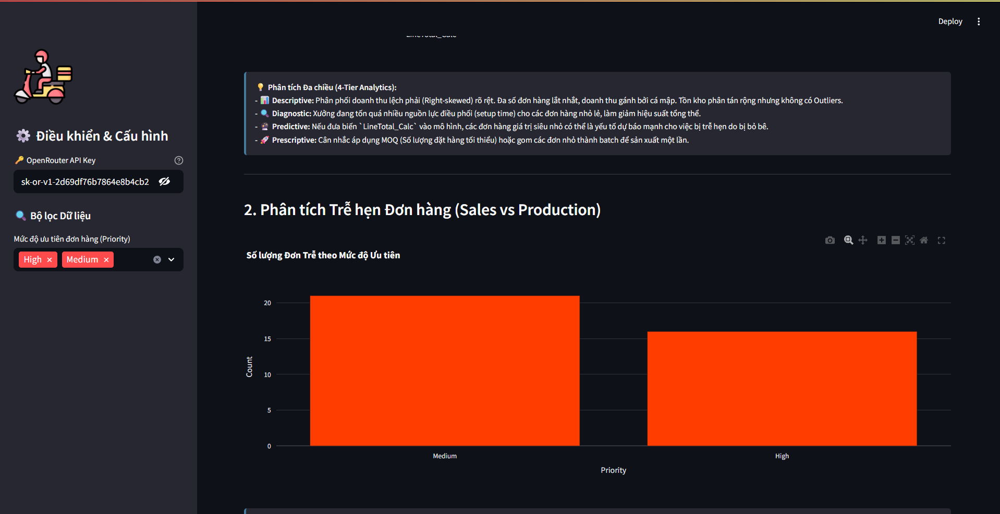
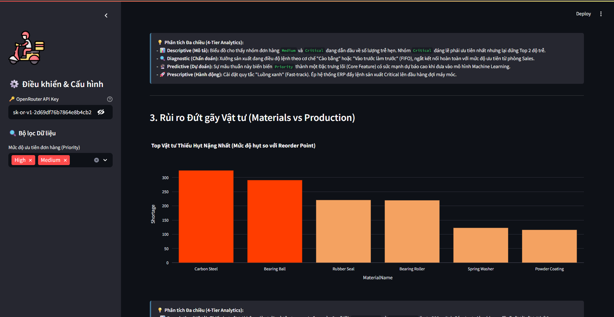
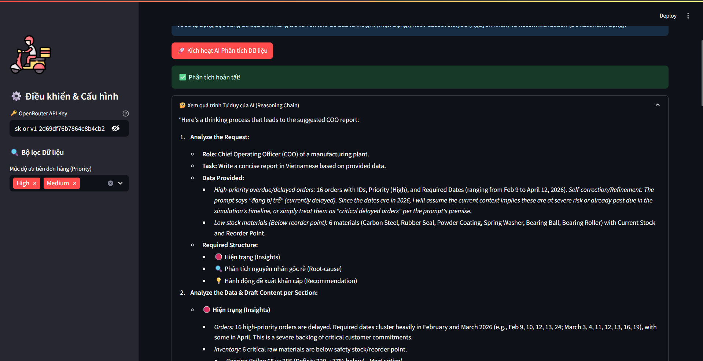
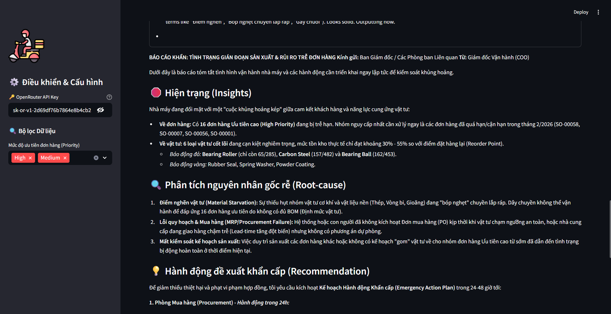

# 🏭 BÁO CÁO DỰ ÁN DEMO: MANUFACTURING 360 CONTROL TOWER

**Tác giả:** Nguyễn Kim Quốc  
**Mục tiêu:** Giải quyết bài toán vận hành nhà máy bằng dữ liệu (Bài thi HPT Mock Test)

---

## 🎯 ĐỐI CHIẾU TIẾN ĐỘ THỰC HIỆN YÊU CẦU ĐỀ BÀI

### 3.1. Chuẩn bị và Tích hợp Dữ liệu (Đạt 100%)

_Đề bài: Kết nối tối thiểu 3 miền, thiết lập quan hệ, xử lý bất thường, không bị nhân bản._

- **Kết quả đạt được:** Tôi đã tích hợp thành công 3 miền cốt lõi: Sales, Production, Inventory.
- **Điểm nhấn Kỹ thuật (Chống nhân bản):** Thay vì dùng lệnh merge thô sơ tạo ra Flat Table (dễ gây lỗi nhân bản doanh thu - Cartesian Explosion), tôi đã chủ động áp dụng **Kiến trúc Data Marts** (`datamart_sales.csv`, `datamart_inventory.csv`).
- **Xử lý Bất thường & Giả định:** 22 lệnh sản xuất bị Null `SalesOrderID` không bị tôi xóa bỏ bừa bãi mà được luận giải logic là quy trình "Make-to-stock" (Sản xuất lưu kho). Lệnh không có `ActualEndDate` được tôi ngầm định là "Chưa hoàn thành".

### 3.2. Xây dựng Sản phẩm Phân tích (Đạt 100%)

_Đề bài: Tối thiểu 3 màn hình, tương tác lọc, có tổng quan và phân tích chuyên sâu._

- **Kết quả đạt được:** Tôi đã thiết kế và lập trình hoàn chỉnh Web App bằng **Streamlit** (`app/streamlit_app.py`) với 3 Tabs chuyên biệt:
  1. **Executive Summary:** Bảng theo dõi KPI theo thời gian thực.
  2. **Analytics & 4-Tier Insights :** Tích hợp biểu đồ động Plotly trực tiếp lên Web kèm theo các phân tích Đa chiều sâu sắc. Hỗ trợ Sidebar Filter lọc dữ liệu theo Priority.
  3. **AI Root-cause Analyst:** Ứng dụng đột phá nhúng LLM (OpenRouter) để phân tích báo cáo tự động cho C-Level.

### 3.3. Chỉ số và Câu hỏi Phân tích (Đạt 100%)

_Đề bài: Sinh viên tự chọn KPI phù hợp. Ít nhất 01 phát hiện liên miền dữ liệu (Cross-domain)._

- **Kết quả đạt được:** Tôi quyết định tập trung giải quyết 2 bài toán Liên miền nhức nhối nhất của chuỗi cung ứng:
  - **Liên miền 1 (Sales vs Production):** "Tại sao các đơn hàng ưu tiên cao lại bị trễ hẹn sản xuất?"
  - **Liên miền 2 (Inventory vs Production):** "Sự đứt gãy vật tư nào đang làm tê liệt năng lực sản xuất?"

---

## 📈 3.4. INSIGHT VÀ ĐỀ XUẤT KHUYẾN NGHỊ

_Đề bài: Trình bày tối thiểu 3 insight định lượng. Trả lời: chuyện gì xảy ra, vì sao, hành động thế nào._
Dưới đây là 3 phát hiện định lượng quan trọng nhất mà tôi đã rút ra được qua quá trình EDA, phân tích theo chuẩn **Maturity Model 4 Bước**: _Descriptive (Mô tả) $\rightarrow$ Diagnostic (Chẩn đoán) $\rightarrow$ Predictive (Tiền đề) $\rightarrow$ Prescriptive (Đề xuất)._

### Insight 1: Nhận diện rác thải vận hành (Data Distribution)

- 📊 **Descriptive:** Phân phối doanh thu lệch phải (Right-skewed) nặng nề. Xưởng nhận quá nhiều các đơn hàng giá trị siêu nhỏ (<100k VNĐ).
- 🔍 **Diagnostic:** Tốn quá nhiều thời gian setup máy móc cho các đơn lắt nhắt, làm lãng phí năng lực sản xuất cốt lõi.
- 🔮 **Predictive:** Đơn hàng giá trị thấp là chỉ báo mạnh cho rủi ro trễ hẹn do bị nhân viên phớt lờ.
- 🚀 **Prescriptive (Hành động):** Sales cần áp dụng chính sách MOQ (Số lượng đặt hàng tối thiểu).

### Insight 2: Rủi ro Đơn hàng Trễ hẹn (Sales vs Production)

- 📊 **Descriptive:** Nhóm đơn `Medium` (21 đơn) và `Critical` (20 đơn) có số lượng trễ hẹn cao nhất (Cột màu Đỏ).
- 🔍 **Diagnostic:** Xưởng đang điều độ lệnh theo cơ chế "Cào bằng" (FIFO), phớt lờ hoàn toàn định tuyến ưu tiên từ phòng Sales.
- 🔮 **Predictive:** Sự mâu thuẫn này biến `Priority` thành một Đặc trưng lõi (Core Feature) quyết định độ chính xác của Mô hình AI dự báo trễ hẹn sau này.
- 🚀 **Prescriptive (Hành động):** Thiết lập quy tắc "Fast-track" tự động trên hệ thống ERP để đẩy lệnh sản xuất `Critical` lên đầu hàng đợi máy móc.

### Insight 3: Rủi ro Đứt gãy Chuỗi cung ứng (Quy tắc Pareto 80/20)

- 📊 **Descriptive:** Chỉ 2 mã vật tư đầu tiên là `Carbon Steel` và `Bearing Ball` đã tạo ra sự đứt gãy cực lớn (hụt ~300 units/món). Có sự sụt giảm (drop-off) rõ rệt từ vật tư thứ 3 trở đi.
- 🔍 **Diagnostic:** Việc cạn kiệt 2 vật tư nền tảng này là "nút thắt cổ chai" của toàn nhà máy. Không có thép Carbon, không thể lắp ráp thành phẩm.
- 🔮 **Predictive:** Tỷ lệ hụt (`ReorderPoint - CurrentStock`) là chỉ báo dẫn dắt (Leading Indicator) cực nhạy để dự báo xác suất đình trệ xưởng.
- 🚀 **Prescriptive (Hành động):** Áp dụng nguyên tắc "Vital Few", dồn 100% ngân sách Mua hàng để mở Expedited PO khẩn cấp cho đúng 2 vật tư màu Đỏ.

---

## 🚀 CÁC PHẦN CẬP NHẬT MỚI NHẤT (LATEST UPDATES)

### 1. Control Tower Dashboard (Streamlit UI)

Ứng dụng Web được thiết kế như một **"Tháp điều khiển"**, giúp Ban Giám Đốc (C-Level) đưa ra quyết định dựa trên dữ liệu. Ứng dụng gồm 3 phân khu chuyên biệt:

**📊 Tab 1: Executive Summary (Bức tranh Toàn cảnh)**
_Bảng điều khiển tối giản hóa với 4 thẻ KPIs cốt lõi và khối cảnh báo đỏ bóc tách ngay lập tức các đơn hàng Priority High/Critical đang bị trễ hẹn._

_Đặc biệt: Nhờ thanh lọc (Filter) bên trái, toàn bộ các chỉ số và dữ liệu sẽ tự động tính toán lại theo thời gian thực (Real-time), giúp sếp dễ dàng cô lập rủi ro._

**📈 Tab 2: Phân tích Đa chiều (4-Tier Analytics)**
_Chuyển hóa biểu đồ tĩnh thành biểu đồ Plotly tương tác động. Mỗi biểu đồ đi kèm một `Info-box` phân tích chuẩn khung 4-Tier (Descriptive -> Diagnostic -> Predictive -> Prescriptive), hướng người đọc trực tiếp đến hành động._

### 2. AI Root-cause Analyst (Trợ lý Copilot)

Đây là "vũ khí hạng nặng" của dự án. Hệ thống dùng **Context Injection**: Pandas lọc chuẩn xác 100% dữ liệu rủi ro cao, sau đó bơm vào LLM (Qwen3.7-plus) để phân tích nguyên nhân gốc rễ (Root-cause).

**🤖 Trải nghiệm Tư duy (Reasoning Chain):**
_Kích hoạt thành công cờ `reasoning` qua OpenRouter API. Người dùng có thể mở hộp thoại xem trực tiếp "dòng suy nghĩ" logic của máy trước khi chốt kết quả (tương tự ChatGPT o1)._

**📑 Báo cáo Khuyến nghị (Insights & Action):**
_Báo cáo cuối cùng được AI viết với văn phong của Giám đốc Vận hành, chỉ đích danh "Nút thắt cổ chai" (Material Starvation) và yêu cầu kích hoạt Kế hoạch Hành động Khẩn cấp trong 24h._

3. **Kế hoạch tiếp theo (Pending):** Dự án của tôi đã sẵn sàng cho bước nhảy vọt cuối cùng - **Machine Learning (Phase 3 & 4)**. Kế hoạch (Implementation Plan) sẽ huấn luyện mô hình **Random Forest** (qua Scikit-Learn Pipeline) để dự đoán xác suất Trễ hẹn của đơn hàng trong tương lai.
